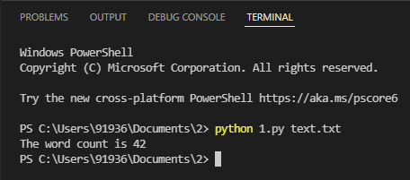
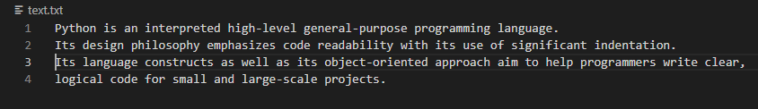

# command-line-arguments-to-count-word
## AIM:
To write a python program for getting the word count from the contents of a file using command line arguments.
## EQUIPEMENT'S REQUIRED: 
PC
Anaconda - Python 3.7
## ALGORITHM: 
### Step 1:
import sys
### Step 2:
Open file using commandline arguments.

### Step 3:
Using for loop find the word count from the contents of a file.

### Step 4:
Use len to count number of words.

### Step 5:
Give print statement.

### Step 6:
End the program 

## PROGRAM:
```
Program for getting the word count from the contents of a file using command line arguments.
Developed by: SASIDEVI.V
RegisterNumber: 22008940
```
```
import sys
f1=open(sys.argv[1])
data=f1.read()
word=data.split()
print("The word count is",len(word))
f1.close() 
```

### OUTPUT:





## RESULT:
Thus the program is written to find the word count from the contents of a file using command line arguments.
